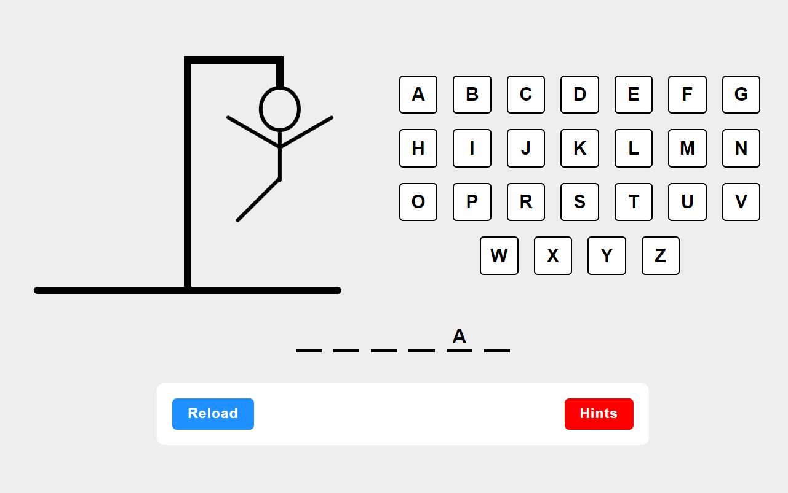

# Hangman React Game



## Introduction

Welcome to Hangman React Game! This is a classic hangman game implemented using React.js. Test your word-guessing skills and have fun with this interactive game.

You can access the deployed version of the game [here](https://velvety-clafoutis-e4b17f.netlify.app/).

## Features

- **Interactive Gameplay:** Guess the letters to uncover the hidden word before you run out of attempts.
- **Random Movie Title Selection:** Every new game starts with a randomly selected word from the dictionary.
- **Hints:** You can click hints button to get hints about the movie
- **Score Tracking:** Keep track of your wins and losses.
- **Responsive Design:** Enjoy the game on various devices - desktop, tablet, or mobile.

## Installation

To run this project locally, follow these steps:

1. Clone the repository:

   ```bash
   git clone https://github.com/your-username/hangman-react-game.git
   ```

2. Navigate to the project directory:

   ```bash
   cd hangman-react-game
   ```

3. Install dependencies:

   ```bash
   npm install
   ```

4. Start the development server:

   ```bash
   npm start
   ```

5. Open your browser and visit `http://localhost:3000` to play the game.

## Technologies Used

- React.js
- HTML
- CSS

## Contributing

Contributions are welcome! If you'd like to contribute to this project, please follow these steps:

1. Fork the repository
2. Create your feature branch (`git checkout -b feature/YourFeature`)
3. Commit your changes (`git commit -am 'Add some feature'`)
4. Push to the branch (`git push origin feature/YourFeature`)
5. Create a new Pull Request

## Credits

This project was created by [Khalil Elemam].

## License

This project is licensed under the MIT License - see the [LICENSE](LICENSE) file for details.
